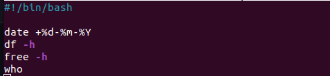
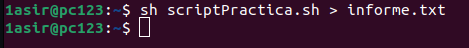
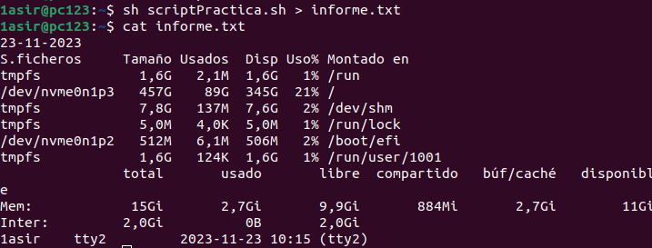

# Redireccionamiento

## Enunciado:
Genera un archivo llamado informe.txt que contenga la siguiente información.
* La fecha del sistema formateada (con día mes y añó)
* El espacio en disco (df -h)
* La memoria libre del sistema (free -h)
* Usuarios conectados
* Ha de subirse una imagen de que el Script se ha ejecutado con éxito

> Los diferentes comandos a ejecutar cuando se introduzca **sh +Nombre de ejecutable** en la línea de comando

> El momento en el que se ejecuta el script en la linea del terminal de Ubuntu

> Y el resultado de visualizar lo que contiene el archivo informe.txt
